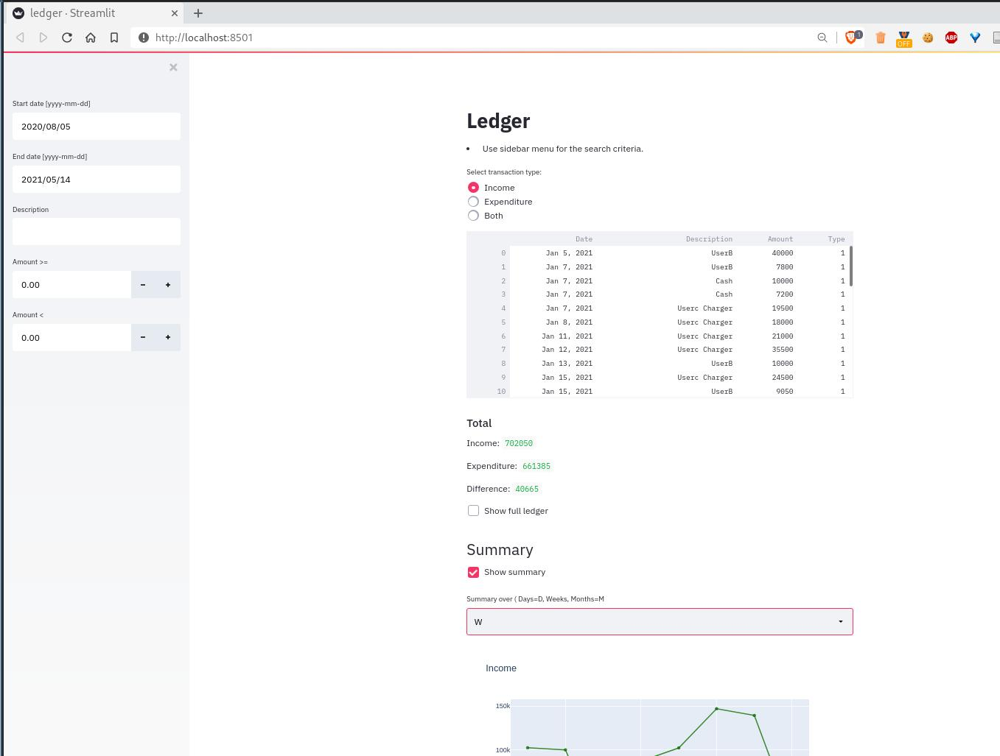
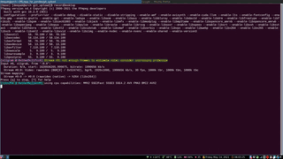

# Ledger
**A very simple web app to summarize ledger using the data science tools** 

This project was conceived to help small businesses to understand the growth of their businesses. Here, a ledger file
income.csv file (entries for sales "1" and purchases "0") is used to keep track of transactions. To analyze the growth
of the business [Pandas](https://pandas.pydata.org/) with [NumPy](https://numpy.org/) are used. A simple web interface
is prepared using [Streamlit](https://streamlit.io/) to interactively understand the data and growth.

##  Demo

## Note
I use bitbucket for the version control as It provides free private repositories. If you want to get full development-history for this code, please email me on mail02ankit@gmail.com.

If you use this code, send me a pizza at mail02ankit@gmail.com

## Contributors
[Ankit Kumar](https://mail02ankit.github.io/)
[Anshu Gupta](https://anshu02gupta.github.io/)
